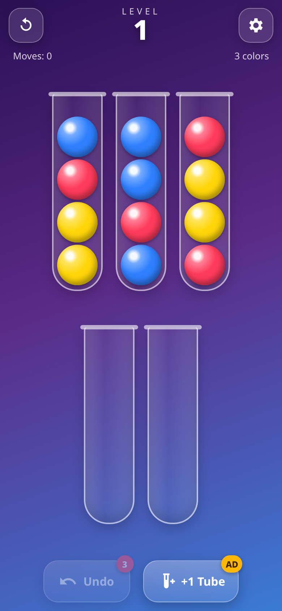
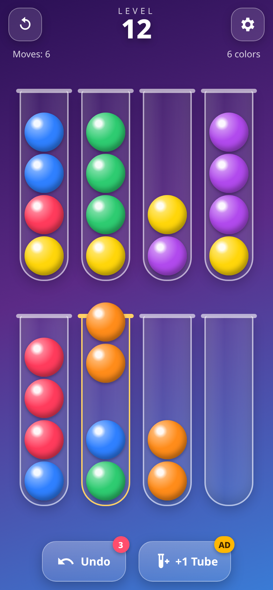
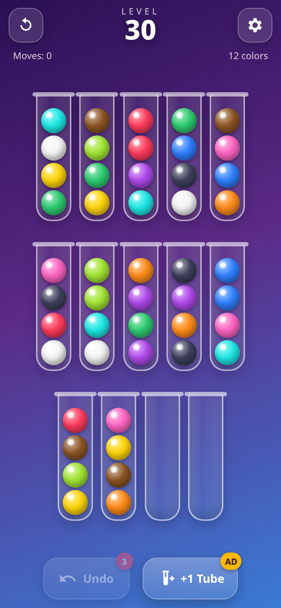
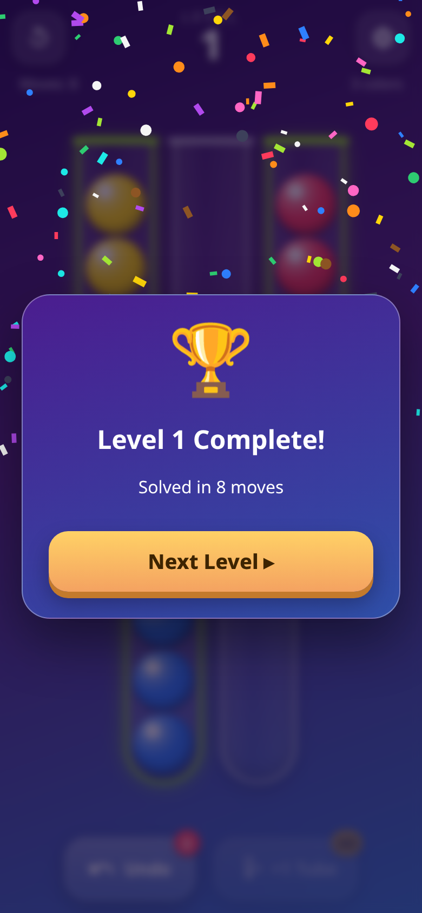

# 🧪 Ball Sort Puzzle

A polished, relaxing **color-sorting puzzle** that works fully **offline**. It's written in vanilla HTML/CSS/JavaScript with no framework, and it ships as an **Android app** (Capacitor + Google AdMob) that **GitHub Actions** builds automatically.

**▶ Play the live demo:** https://offerpk.github.io/ball-sort-puzzle/
**Privacy policy:** https://offerpk.github.io/ball-sort-puzzle/privacy.html

<p align="center">
  
  
  
  
</p>

## How to play

- Every tube holds up to **4 balls**.
- **Tap a tube** to lift its top ball(s), then **tap another tube** to pour them.
- You can only pour onto a ball of the **same color** or into an **empty tube**, and only while the tube has room.
- You win when every tube is either **full of one color** or **empty**.
- **Hint** highlights one recommended legal move without changing the board or using a move.
- **Undo** gives you 3 free undos per level. After that, a rewarded ad gives you 3 more.
- **+1 Tube** adds an extra empty tube once per level (rewarded ad).
- **Restart** (top left) resets the level. **Settings** (top right) toggles sound and vibration and lets you reset your progress.

## Features

- **Endless procedural levels.** Level *N* is generated from seed *N*, so it's the same for everyone. Difficulty grows from 3 colors up to 12 (+1 color every 3 levels), and there are always 2 empty tubes.
- **Every level is guaranteed solvable.** Each generated board is checked by a built-in depth-first solver (`www/js/logic.js`), and boards that aren't solvable are rejected.
- Smooth ball-lift and arc-pour animations, confetti win celebration, and haptics.
- Sound effects synthesized with **WebAudio** (no audio files).
- Progress is saved in `localStorage`, including a level you're partway through.
- Portrait, touch-first layout that respects safe areas and adapts to 1–3 rows of tubes.
- No build step: open `www/index.html` or serve the folder.

## Project layout

```
www/                  ← the whole game (also the Capacitor webDir & Pages site)
  index.html, css/style.css, privacy.html, icon.png
  js/logic.js         ← pure rules, seeded generator, solver (Node + browser)
  js/game.js          ← UI, animations, persistence
  js/sound.js         ← WebAudio SFX
  js/ads-config.js    ← ★ ALL AdMob IDs live here
  js/ads.js           ← showBanner / showInterstitial / showRewarded
android/              ← Capacitor Android project (committed)
assets/               ← app icon sources (make_icon.py) + 512px Play Store icon
test/                 ← node logic test + headless-Chrome play test
.github/workflows/    ← android.yml (AAB/APK + Releases), pages.yml (web demo)
```

## Run locally

```bash
npm install
npm run serve          # http://localhost:8080
npm test               # generates & solves levels 1..1000 headlessly
```

Headless browser test (plays levels by tapping, saves phone screenshots):

```bash
npm i --no-save puppeteer-core
node test/browser.test.js http://localhost:8080/ /tmp   # needs Chrome at /usr/bin/google-chrome (or set CHROME=...)
```

## Ads (AdMob)

`www/js/ads.js` exposes three hooks:

| Hook | When | In a browser |
|---|---|---|
| `Ads.showBanner()` | on start (adaptive banner, bottom) | no-op |
| `Ads.showInterstitial()` | after every **3** completed levels, **at most once per 60 s** | no-op |
| `Ads.showRewarded(onReward)` | extra undos, +1 tube | grants the reward immediately |

Inside the Android app they call [`@capacitor-community/admob`](https://github.com/capacitor-community/admob), which also shows Google's UMP consent form when it's required (EEA/UK).

### Swapping in your real AdMob IDs

The repo currently uses **Google's official test IDs**. Change them in exactly **two** places:

1. **`www/js/ads-config.js`**: set `APP_ID`, `BANNER_ID`, `INTERSTITIAL_ID`, and `REWARDED_ID`, then set `IS_TESTING: false`.
2. **`android/app/src/main/AndroidManifest.xml`**: set the `com.google.android.gms.ads.APPLICATION_ID` meta-data value to your real **App ID** (`ca-app-pub-XXXX~YYYY`).

Then commit and push, and CI builds a new AAB. In AdMob, also set up **Privacy & messaging → GDPR message** so the consent form works, and add an `app-ads.txt` to your developer website.

## Android build

- Capacitor 8, appId **`com.offerpk.ballsort`**, name **Ball Sort Puzzle**
- `compileSdk`/`targetSdk` **36** (Android 16, which Google Play requires for new apps and updates since Aug 31 2026), `minSdk` 24, versionCode **2**, versionName **1.0.1** (in `android/app/build.gradle`)

### CI (GitHub Actions)

`.github/workflows/android.yml` runs on every push to `main`, on `v*` tags, and on manual dispatch. It runs Node 22 + JDK 21 → `npm ci` → logic tests → `npx cap sync android` → `./gradlew bundleRelease assembleRelease`. The signed **`.aab`** and **`.apk`** are uploaded as workflow artifacts. On a `v*` tag, the workflow also creates a **GitHub Release** with both files attached.

Signing uses these repository secrets:

| Secret | Contents |
|---|---|
| `KEYSTORE_BASE64` | `base64 -w0 upload.jks` |
| `KEYSTORE_PASSWORD` | keystore password |
| `KEY_ALIAS` | key alias (`upload`) |
| `KEY_PASSWORD` | key password |

The keystore and passwords are **never** committed. Gradle reads them from the environment variables `ANDROID_KEYSTORE_FILE`, `KEYSTORE_PASSWORD`, `KEY_ALIAS`, and `KEY_PASSWORD`.

### Build locally

```bash
npm ci
npx cap sync android
cd android
ANDROID_KEYSTORE_FILE=/path/upload.jks KEYSTORE_PASSWORD=... KEY_ALIAS=upload KEY_PASSWORD=... \
  ./gradlew bundleRelease assembleRelease
# → app/build/outputs/bundle/release/app-release.aab
# → app/build/outputs/apk/release/app-release.apk
```

Or open `android/` in Android Studio (`npx cap open android`).

## Releasing to Google Play

1. Bump `versionCode` (+1 every upload) and `versionName` in `android/app/build.gradle`, and switch to your real AdMob IDs (see above).
2. Commit, then tag and push: `git tag v1.0.1 && git push origin v1.0.1`. CI attaches `ball-sort-puzzle-v1.0.1.aab` and `.apk` to a GitHub Release.
3. In [Play Console](https://play.google.com/console), create the app (package `com.offerpk.ballsort`) and enable **Play App Signing**. Your CI keystore is the **upload key**.
4. Fill in the store listing: the 512×512 icon is at `assets/play-store-icon-512.png`, and you'll also need a 1024×500 feature graphic and phone screenshots (see `docs/`).
5. **App content**: enter the privacy policy URL `https://offerpk.github.io/ball-sort-puzzle/privacy.html`, declare **Contains ads = Yes**, answer the **Advertising ID** declaration (yes, used by AdMob for advertising), and complete the Data safety form, content rating, and target audience.
6. Upload the `.aab` to Internal testing, then promote it to Production. New personal developer accounts must first run a closed test (12+ testers for 14 days).

## License

[MIT](LICENSE) © 2026 OfferPk. See also the [Privacy Policy](PRIVACY.md).
